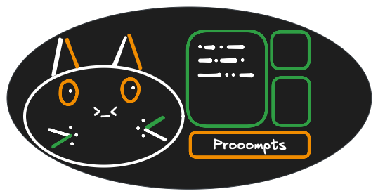

<p align="center">
  
  <h1 align="center">
    NEKOT
  </h1>

**A powerful and intuitive terminal utility for interacting with both local and cloud LLMs.**

A tool for those who appreciate keyboard driven apps and terminal workflows

</p>

## Features
 * 📦 **Single binary** - lightweight, zero dependencies, use anywhere without any requirements
 * 🤖 **Support for OpenAI compatible APIs** (ChatGPT, Mistral, Ollama, LMStudio, llama-cpp and more)
 * 🌟 **Support for Gemini API**
 * 🔀 **Support for OpenRouter API**
 * 🖼️ **Images support**
 * 🔍 **Web search tool [BETA]**
 * 💬 **Chat sessions** management and quick chats
 * ⚙️ **Settings presets** (configure different personas with unique settings)
 * ✂️ **Convenient text selection** tool (vim-like line selection)
 * 🌐 **Crossplatform** - support for MacOS, Windows and Linux
 * 🎨 **Multiple themes**

## Demo


## App installation

**Ensure API keys are set before proceeding to installtion**

### Homebrew (MacOS, Linux)

```bash
brew tap BalanceBalls/BalanceBalls
brew install nekot --cask
```

### Chocolatey (Windows)

```bash
choco install nekot
```

### Shell script (Linux, MacOS)

Requires `curl` and `tar`.

**For updating the app, just run the script again**

**Basic install:**
* Requires `sudo`, and installs to `/usr/local/bin/`
```bash
curl -fsSL https://raw.githubusercontent.com/BalanceBalls/nekot/main/install.sh | sudo sh
```

**Install to path:**
* Use `-p` flag to specify install path.
* Make sure the specified directory is in the `$PATH`.
* May require `sudo` depending on the path specified.
```bash
bash -c "$(curl -fsSL https://raw.githubusercontent.com/BalanceBalls/nekot/main/install.sh)" -- -p ~/.local/bin
```

### Download binary/executable (Windows, MacOS, Linux)

1. [Go to latest release](https://github.com/BalanceBalls/nekot/releases/latest)
2. Download and extract the archive
3. Place the binary/executable in some directory
4. Add that directory to `$PATH`

## Setting API keys

To use the app, you will need to set `OPENAI_API_KEY` or/and `GEMINI_API_KEY`, `OPENROUTER_API_KEY` env variables depending on your needs

<details>

<summary>API keys guide</summary>

### OpenAI APIs

Set up your openai api key:
* ChatGPT: [how to get an api key](https://platform.openai.com/api-keys)
* Mistral: [how to get an api key](https://docs.mistral.ai/getting-started/quickstart/#account-setup)

```bash
export OPENAI_API_KEY="some-key" # you would want to export this in your .zshrc or .bashrc
```

### Gemini API

Set up your api key - [how to get an api key](https://aistudio.google.com/apikey)

```bash
export  GEMINI_API_KEY="some-key" # you would want to export this in your .zshrc or .bashrc
```

### OpenRouter API

Set up your api key - [how to get an api key](https://openrouter.ai/docs/api-reference/authentication)

```bash
export  OPENROUTER_API_KEY="some-key" # you would want to export this in your .zshrc or .bashrc
```
</details>

## Stdin piping

You can pipe input into the app and do things like this:
```bash
cat PROMPT.md | nekot -p openai -u http://localhost:11434 -m gpt-oss:latest -n
```

## Web search (BETA)

Web search feature uses tool calling for web search reqests exectution.
This feature can be toggled using `Ctrl+w`.

### Details
* Uses the [DuckDuckGo](https://duckduckgo.com/) and [Brave](https://search.brave.com/) search engines and requires no configuration
* Results are scored using bm25 for better accuracy
* **Using web search can significantly increase token usage**

## Config

We provide a `config.json` file within your directory for easy access to essential settings.
- On **MacOS & Linux**, the path is `~/.nekot/config.json`.
- On **Windows**, the path is `C:\Users\%UserName%\.nekot\config.json` or `%HOMEPATH%\.nekot\config.json`

### Example
```json
{
  "providerBaseUrl": "https://api.openai.com", // Or http://localhost:11434, or any other OpenAi compatible API
  "systemMessage": "",
  "defaultModel": "",
  "colorScheme": "groove", // pink, blue, groove
  "provider": "openai", // openai, gemini, openrouter
  "maxAttachmentSizeMb": 3,
  "includeReasoningTokensInContext": true,
  "sessionExportDir": "~/.nekot/exports"
}
```

 - `providerBaseUrl`: The url can be anything that follows OpenAI API standard ( [ollama](http://localhost:11434), [lmstudio](http://127.0.0.1:1234), etc)
 - `chatGPTApiUrl` [obsolete]: same as `providerBaseUrl`
 - `systemMessage` field is available for customizing system prompt messages. **Better to set it from the app**
 - `defaultModel` field sets the default model.  **Better to set it from the app**
 - `maxAttachmentSizeMb` field sets maximum allowed image size
 - `includeReasoningTokensInContext` field sets whether to include reasoning tokens in the next request or not.
 - `sessionExportDir` allows to specify directory for session exports. If not set, exports are saved to current directory


### Providers

You can change API provider using the `provider` field.

Available providers:
 * `openai` **default**
 * `gemini`
 * `openrouter`

To use **GeminiAPI**, just set `"provider": "gemini"` (make sure to set GEMINI_API_KEY env variable).
When using the `gemini` or `openrouter` providers, `providerBaseUrl` param is not used.

### Themes
You can change colorscheme using the `colorScheme` field.

Available themes:
 * `groove` **default**
 * `pink`
 * `blue`


## Data migration

If you need your settings and chats on other machine - simply copy `chat.db` and `config.json` from the `.nekot/` directory
and paste to the same directory on other machine.

## Flags

### Cache invalidation

Models list is cached for 14 days upon loading. If you need to invalidate cache use `--purge-cache` flag:
```bash
nekot --purge-cache
```

### Provider

To switch between openai and gemini APIs you can use `-p` flag:
```bash
nekot -p openai
nekot -p gemini
nekot -p openrouter
```

### Provider url

To specify provier url use `-u` flag(works with the openai provider only):
```bash
nekot -u http://localhost:11434
```

### Theme

To specify color scheme use `-t` flag:
```bash
nekot -t blue
```

### Other flags

To specify a model use `-m` flag:
```bash
nekot -m "qwen3:4b"
```

To create a new session on start use `-n` flag:
```bash
nekot -n
```

## Global Keybindings

- `Tab`: Change focus between panes. The currently focused pane will be highlighted
- `1-4` pane jumps: `1` **prompt** pane, `2`, **chat** pane, `3` **settings** pane, `4` **sessions** pane
- `Ctrl+b` or `Ctrl+s`: Interrupt inference
- `Ctrl+o`: Toggles zen mode
- `Ctrl+c`: Exit the program
- `Ctrl+n`: Create new session
- `Ctrl+w`: Toggles web search (preset level setting)
- `Ctrl+h`: Hide/show reasoning tokens (preset level setting)
- `Ctrl+q`: Start quick chat
- `Ctrl+x`: Save quick chat to session

## Prompt Pane

- `i`: Enters insert mode (you can now safely paste messages into the tui)
- `Ctrl+e`: Open/Close prompt editor
- `Ctrl+r`: Clear prompt
- `Ctrl+v`: Paste text from buffer
- `Ctrl+s`: Paste text from buffer as a code block (only in editor mode)
    * if current line contains text, that text will be used as a language for the code block
    * Example: if a line contains `go` the result of `Ctrl+s` will be:

    \```go <br>
    {bufferContent} <br>
    \```
- `esc`: Exit insert mode for the prompt
    * When in 'Prompt editor' mode, pressing `esc` second time will close editor
- `Ctrl+a`: open file picker for attaching images. You can also attach images by typing: [img=/path/to/image]

## Chat Messages Pane

- `y`: Copies the last message into your clipboard.
- `Shift+y`: Copies all messages from current session into your clipboard.
- `v`, `Shift+v` or `space`: Enters navigation mode when chat pane is focused (allows to move accross the chat content lines)

### Selection mode

Selection mode allows to navigate the chat pane and select lines to copy. Supports basic vim-motions.

<b>Navigation</b>
 - `j`, `k` - go down and up a line
 - `d`, `u`, `Ctrl+d`, `Ctrl+u` - go up or down half page
 - `g` - go to top
 - `Shift+g` - go to bottom

<b>Selection</b>
 - `d`, `u`, `Ctrl+d`, `Ctrl+u` - go up or down half page
 - `j`, `k` - go down and up a line
   - Multiline jumps like `3j` (3 lines down), `99k` (99 lines up) are also supported
- `v`, `Shift+v` or `space` to enter or quit line selection mode
- `y` to copy selected text (with formatting from the app)
- `r`, `c` to copy selected text as raw LLM output
- `Esc` to quit selection or navigation modes

## Settings Pane

- `[` and `]`: switch between presets and settings tabs

### Settings tab
- `m`: Opens a model picker to change the model. (use `/` to set filter)
- `f`: Change the frequency value
- `t`: Change the maximum number of tokens per message
- `e`: Change the temperature value
- `p`: Change the top_p value (nucleus sampling)
- `s`: Opens a text editor to edit system prompt
- `Ctrl+r`: resets current settings preset to default values
- `Ctrl+p`: creates new preset with a specified name from the current preset

### Presets tab
- `d`: remove preset (default and current selected presets cannot be removed)
- `enter`: select preset as the current one
- `/`: filter presets

## Sessions Pane

- `Ctrl+n`: Creates a new session.
- `Shift+X`: Exports session to a markdown file.
- `d`: Deletes the currently selected session from the list.
- `e`: Edit session name
- `Enter`: Switches to the session that is currently selected.
- `/`: filter sessions

## Info pane

Information pane displays processing state of inference (`IDLE`, `PROCESSING`) as well as token stats for the current session:
 - `IN`: shows the total amount of input tokens LLM consumed per session
 - `OUT`: shows the total amount of output tokens LLM produced per session

Please refer to this guide as you navigate the TUI. Happy exploring!

### Dev notes

The SQL db is stored in you `your/home/directory/.nekot`, as well as the debug log. To enable `debug` mode, `export DEBUG=1` before running the program.

To get access to the release candidates, install command:

```bash
brew install rc-nekot
rc-nekot
```

## Technologies

- Go
- [bubbletea](https://github.com/charmbracelet/bubbletea): A Go framework for
  terminal user interfaces. It's a great framework that makes it easy to create
  TUIs in Go.
- [openai](https://platform.openai.com/docs/api-reference): OpenAI's REST Api
- [sqlite](https://gitlab.com/cznic/sqlite): CGO-free sqlite lib
- [lipgloss](https://github.com/charmbracelet/lipgloss): Style definitions for
  nice terminal layouts!
- [bubbles](https://github.com/charmbracelet/bubbles): Some general use
  components for Bubble Tea apps!
- [operouter-sdk](https://github.com/reVrost/go-openrouter) openrouter api sdk

## Contributors

<!-- ALL-CONTRIBUTORS-LIST:START - Do not remove or modify this section -->
<!-- prettier-ignore-start -->
<!-- markdownlint-disable -->
<table>
  <tbody>
    <tr>
      <td align="center" valign="top" width="14.28%"><a href="https://github.com/BalanceBalls"><br /><sub><b>BalanceBalls</b></sub></a><br /><a href="#doc-BalanceBalls" title="Documentation">📖</a> <a href="#code-BalanceBalls" title="Code">💻</a></td>
      <td align="center" valign="top" width="14.28%"><a href="https://twitter.com/tearingitup786"><br /><sub><b>Taranveer (Taran) Bains</b></sub></a><br /><a href="#doc-tearingItUp786" title="Documentation">📖</a> <a href="#maintenance-tearingItUp786" title="Maintenance">🚧</a> <a href="#review-tearingItUp786" title="Reviewed Pull Requests">👀</a> <a href="#code-tearingItUp786" title="Code">💻</a></td>
      <td align="center" valign="top" width="14.28%"><a href="https://www.tjmiller.me"><br /><sub><b>TJ Miller</b></sub></a><br /><a href="#doc-sixlive" title="Documentation">📖</a> <a href="#code-sixlive" title="Code">💻</a></td>
    </tr>
  </tbody>
</table>

<!-- markdownlint-restore -->
<!-- prettier-ignore-end -->

<!-- ALL-CONTRIBUTORS-LIST:END -->
